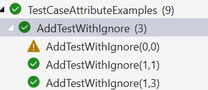
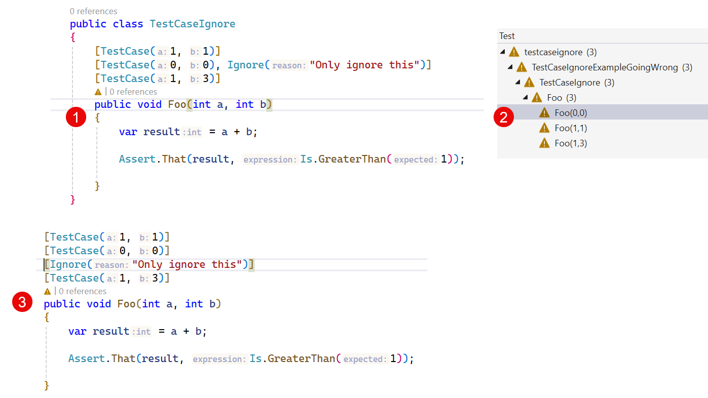

# TestCase

`TestCaseAttribute` serves the dual purpose of marking a method with parameters as a test method and providing inline
data to be used when invoking that method. Here is an example of a test being run three times, with three different sets
of data:

[!code-csharp[BasicTestCase](~/snippets/Snippets.NUnit/Attributes/TestCaseAttributeExamples.cs#BasicTestCase)]

> [!NOTE]
> Because arguments to .NET attributes are limited in terms of the Types that may be used, NUnit will make some
> attempt to convert the supplied values using `Convert.ChangeType()` before supplying it to the test.

**TestCaseAttribute** may appear one or more times on a test method, which may also carry other attributes providing
test data. The method may optionally be marked with the [Test Attribute](test.md) as well.

By using the named parameter `ExpectedResult` this test set may be simplified further:

[!code-csharp[TestCaseWithExpectedResult](~/snippets/Snippets.NUnit/Attributes/TestCaseAttributeExamples.cs#TestCaseWithExpectedResult)]

In the above example, NUnit checks that the return value of the method is equal to the expected result provided on the
attribute.

TestCaseAttribute supports a number of additional named parameters:

* **Author** sets the author of the test.
* **Category** provides a comma-delimited list of categories for this test.
* **Description** sets the description property of the test.
* **ExcludePlatform** specifies a comma-delimited list of platforms on which the test should not run.
* **ExpectedResult** sets the expected result to be returned from the method, which must have a compatible return type.
* **Explicit** is set to true in order to make the individual test case Explicit. Use **Reason** to explain why.
* **Ignore** causes the test case to be ignored and specifies the reason.
* **IgnoreReason** causes this test case to be ignored and specifies the reason.
* **IncludePlatform** specifies a comma-delimited list of platforms on which the test should run.
* **Reason** specifies the reason for not running this test case. Use in conjunction with **Explicit**.
* **TestName** provides a name for the test. If not specified, a name is generated based on the method name and the
  arguments provided. See [Template Based Test Naming](xref:templatebasedtestnaming).
* **TestOf** specifies the Type that this test is testing (this is not used within NUnit during test execution,
  but may serve a purpose for the test author)
* **TypeArgs** specifies the `Type`s to be used when targeting a generic test method. (_NUnit 4.1+_)

## Be aware of mixing the syntax for named parameters and attributes with the same name

### Ignore done right and wrong

[!WARNING]
When using the **Ignore** parameter (and others, see below), note that this has to be a named parameter. It is easy to add another Ignore attribute after the TestCase attribute. That will be the same as adding it separately, and it will apply to the complete fixture. Note, that this might apply to more of these named parameters, with names equal to other attributes, like the Explicit and Category parameters.

[!TIP]
Doing it right!

[!code-csharp[TestCaseWithIgnore](~/snippets/Snippets.NUnit/Attributes/TestCaseAttributeExamples.cs#TestCaseWithIgnore)]

[!WARNING]
Wrong way! (1) Adding it on the same line is the same as adding it on a separate line (3), both results in the fixture being ignored (2).

_Thanks to [Geir Marius Gjul](https://github.com/GeirMG) for raising this question again._

### Explicit done correct

Explicit is another one, and done correctly as:

[!code-csharp[TestCaseWithExplicit](~/snippets/Snippets.NUnit/Attributes/TestCaseAttributeExamples.cs#TestCaseWithExplicit)]

Note that adding the Reason is optional, and Visual Studio TestExplorer will not even show it.

### Category done correct

Categories can be applied to a single testcase the same way, as a named parameter. Otherwise it will apply to the whole fixture. Be sure what you're asking for!

[!code-csharp[TestCaseWithCategory](~/snippets/Snippets.NUnit/Attributes/TestCaseAttributeExamples.cs#TestCaseWithCategory)]

## Order of Execution

Individual test cases are executed in the order in which NUnit discovers them. This order does **not** necessarily
follow the lexical order of the attributes and will often vary between different compilers or different versions of the
CLR.

As a result, when **TestCaseAttribute** appears multiple times on a method or when other data-providing attributes are
used in combination with **TestCaseAttribute**, the order of the test cases is undefined.
